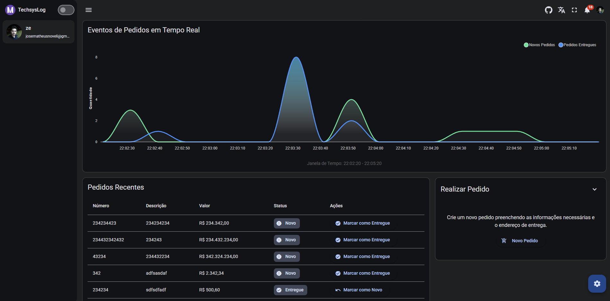

# 🚚 TechSys Logística




## 📋 Sobre o Projeto

O Objetivo do projeto é demonstar o uso do .NET 10 em conjunto com Angular para criar uma aplicação com dados em tempo real.

## 🚀 Tecnologias

### Backend
- **.NET 10** - Framework principal
- **MongoDB** - Banco de dados NoSQL
- **Identity** - Sistema de autenticação e autorização
- **[BrasilAPI](https://github.com/BrasilAPI/BrasilAPI)	** - Integração com API de CEP

### Frontend
- **Angular** - Framework frontend
- **[ng-matero](https://github.com/ng-matero/ng-matero)** - Template base para o frontend

## ✨ Funcionalidades

- Autenticação e autorização de usuários
- Gerenciamento de operações logísticas
- Obtenção de CEP através de API brasileira
- Interface moderna e responsiva

## 🛠️ Como Executar

### 🐳 Usando Docker Compose (Recomendado)

A forma mais simples de executar o projeto é usando Docker Compose, que irá inicializar todos os serviços necessários:

#### Pré-requisitos
- [Docker](https://www.docker.com/get-started) instalado
- [Docker Compose](https://docs.docker.com/compose/install/) instalado

#### Passos

```bash
# Clone o repositório
git clone https://github.com/josematheus10/TechsysLog.git
cd TechsysLog

# Execute todos os serviços
docker-compose up -d

# Visualize os logs (opcional)
docker-compose logs -f

# Acesse a aplicação
# Frontend: http://localhost:4200
# Backend API: http://localhost:5000
# Swagger (Documentação da API): http://localhost:5000/swagger
# MongoDB: localhost:27017
```


### 💻 Execução Manual (Desenvolvimento)

#### Pré-requisitos
- .NET 10 SDK
- Node.js e npm
- MongoDB

#### Backend

```bash
# Navegue até a pasta do backend
cd Backend

# Restaure as dependências
dotnet restore

# Execute o projeto
dotnet run
```

#### Frontend

```bash
# Navegue até a pasta do frontend
cd Frontend

# Instale as dependências
npm install

# Execute o projeto
npm start
```

## 📝 Licença

Este projeto está sob a licença MIT.
